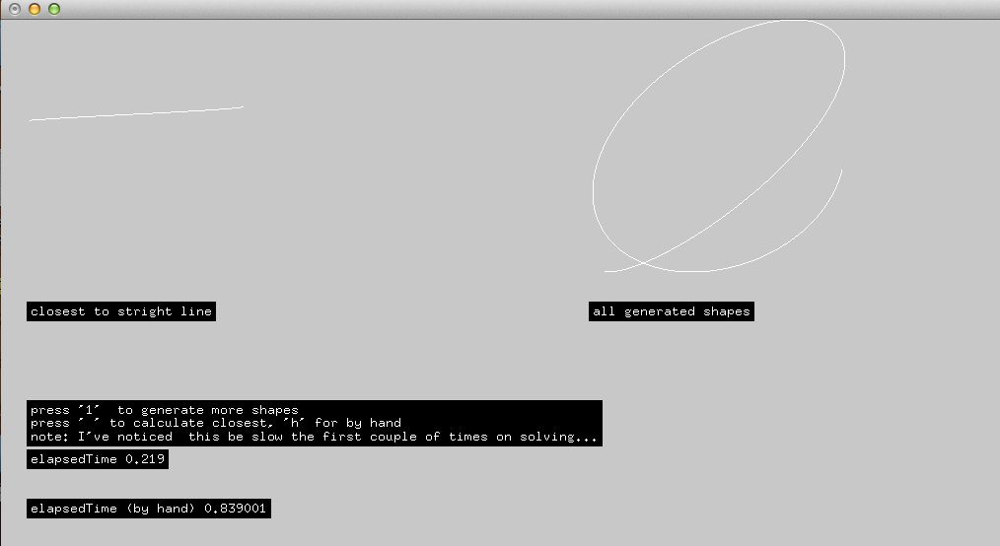

accelerateExample
=================

example of using openframeworks and apple's accelerate framework

this example generates 100,000 random shapes with 256 points each,  using sin and cos (with random angle speeds, etc) and finds the one closest to a straight line, a shape with x increaing linearly and y constant.  It uses apple's accelerate framework to do the math, grouping all the data into giant vectors for subtraction, distance and mean calculation. 

I will add some benchmarks shortly, but it seems to be a pretty substantial speed up (as far as I can tell)…   posting this here in case it's helpful for anyone looking for accelerate examples. 

Also, I found [this tutorial](http://www.ffnn.nl/pages/articles/apple-mac-os-x/vectorizing-with-vdsp-and-veclib.php) pretty helpful.